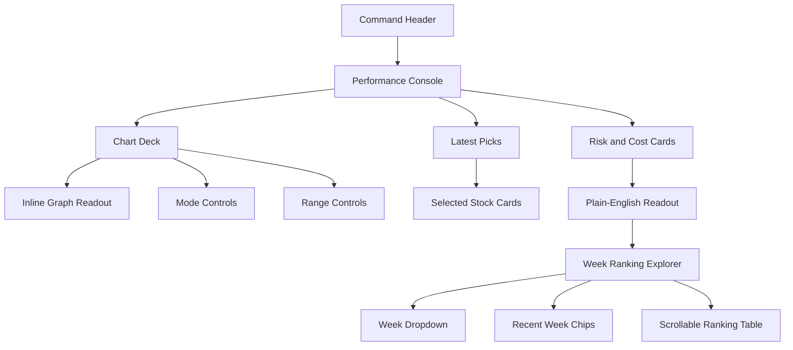
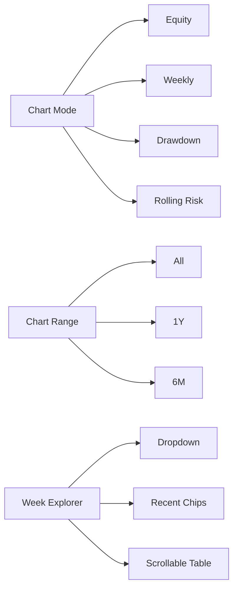

# Dashboard UI/UX Concepts

## Product Frame

The dashboard is a public strategy-monitoring surface for a weekly momentum system. The interface should help a viewer answer four questions quickly:

- Is the strategy doing well?
- What changed this week?
- How risky is the current path?
- Which stocks were selected and why?

## Style Options

### Option A: Quant Terminal

Dense, dark, information-rich, and trader-oriented.

Strengths:
- Feels serious and market-native.
- Works well for power users.

Tradeoffs:
- Can feel intimidating.
- Harder for hackathon judges to understand at a glance.

### Option B: Strategy Command Desk

Hybrid light/dark dashboard with a strong command header, semantic colors, and clear operational zones.

Strengths:
- Immersive without becoming noisy.
- Good for at-a-glance judging.
- Keeps research metrics readable.
- Works well as a public SaaS-style page.

Tradeoffs:
- Requires careful spacing so the top section does not become too heavy.

### Option C: Editorial Research Brief

Clean report-like interface with a large chart, narrative callouts, and fewer controls.

Strengths:
- Very readable.
- Good for explaining findings.

Tradeoffs:
- Less interactive.
- Feels less like a product dashboard.

## Chosen Direction

**Option B: Strategy Command Desk** is the best fit.

It balances a polished SaaS/product feel with the practical needs of a financial strategy dashboard. The UI should feel like a clean operating desk: high-signal, structured, and calm.

## Page Map

## Control Diagram

## Color System

| Token | Use | Color |
| --- | --- | --- |
| Ink | Primary text and active controls | `#121a18` |
| Deep pine | Header/console background | `#0e2a25` |
| Mist | Page background | `#eef4f1` |
| Panel | Cards and tables | `#ffffff` |
| Teal | Net performance and selected items | `#16845b` |
| Blue | Gross performance | `#2e64d8` |
| Amber | Cost drag and caution | `#b7791f` |
| Plum | Secondary accent | `#6f4bb2` |
| Coral | Negative returns and risk | `#bf4d45` |

## Section Behavior

- Header stays focused on product identity and status.
- Performance console shows the most important metrics first.
- Chart deck keeps controls, graph, legend, and readout in one visual unit.
- Latest picks are quick decision cards.
- Week explorer shows one rebalance week at a time instead of a long data dump.
